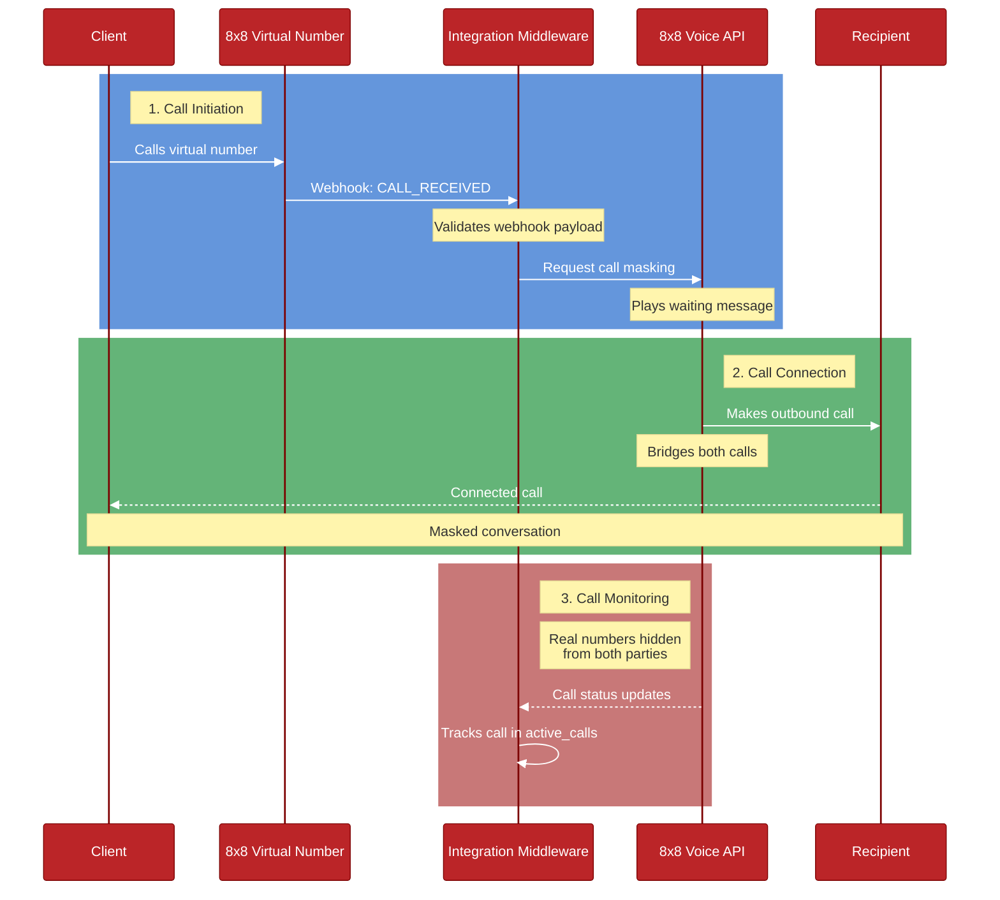

# Call Masking Flow

This diagram illustrates the call masking flow implemented in this service.

## Flow Description

1. A caller dials the virtual number assigned to the service
2. The service receives a webhook notification for the incoming call
3. The server validates the call information and initiates call masking
4. Voice API plays a waiting message to the caller
5. The service makes an outbound call to the forwarded number
6. Both calls are bridged while maintaining number privacy
7. The conversation proceeds with both parties' real numbers masked
8. The service tracks active calls and their status

## Key Components

- **Virtual Number**: The public-facing number that callers dial
- **Server**: FastAPI service handling webhook events and call control
- **Voice API**: 8x8 Voice API handling call execution and bridging
- **Forwarded Number**: The final destination number (kept private)