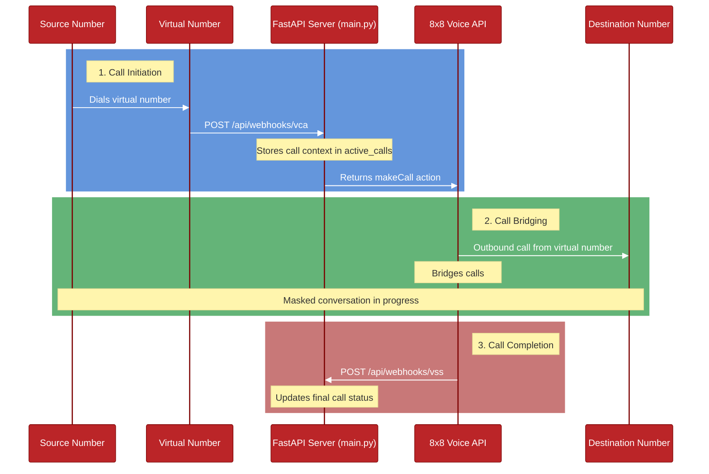

# Call Masking Flow

This diagram illustrates the actual implementation of call masking in this service.

## Implementation Details

1. **Call Initiation** (`/api/webhooks/vca`)
   - Client makes call to the virtual number
   - Receive incoming call webhook from 8x8
   - Validate required configuration (API key, subaccount, numbers)
   - Store call context in `active_calls` dictionary
   - Return callflow with `makeCall` action

2. **Call Management**
   - Virtual number used as source for outbound call
   - Both parties see only the virtual number

3. **Call Completion** (`/api/webhooks/vss`)
   - Either party hangs up
   - Receive final call status webhook
   - Update call record in `active_calls`
   - Track call completion status
