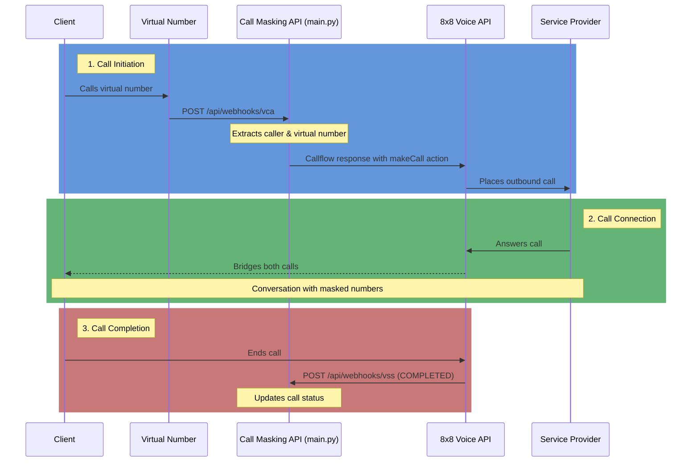

# Voice Call Masking - Simplified Call Flow

## Key Points

1. **Call Initiation**
   - Client calls the virtual number
   - System receives webhook notification
   - Call masking service initiates outbound call to provider

2. **Call Connection**
   - Provider answers the call
   - Voice API bridges both call legs
   - Both parties communicate with masked numbers

3. **Call Completion**
   - Call ends (by either party)
   - System receives session completion webhook
   - Call details are recorded for tracking
